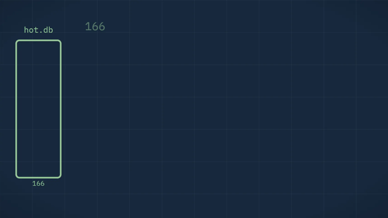
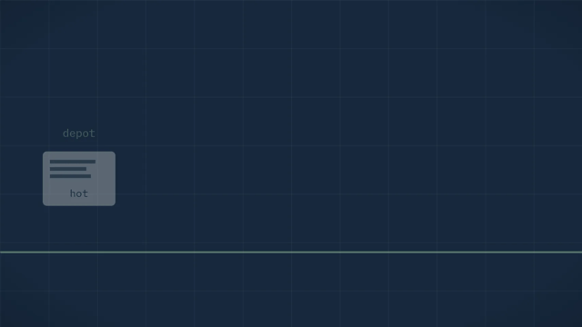
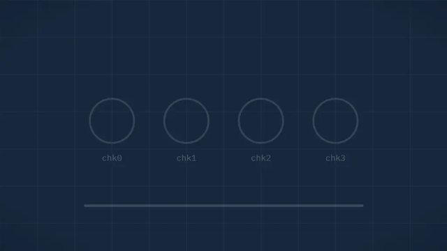

# moltarc — shrink + ship + find


Tiered SQLite database system: hot DB stays small and fast,
warm chunks compress schema-aware, cold archive ships once, query stays partial.

```
[hot.db r/w SQLite] --seal--> [warm/*.zst 1-4MB immutable] --merge--> [cold/*.tar.zst] + manifest.json
```

## See it work (12s each, loops)

| | |
|---|---|
| <br>**1. Hot stays boring** — 6000 rows land in plain SQLite, counter climbs, nothing custom. (`src/seal.ts` reads WAL) | <br>**2. Seal** — rows funnel into immutable chunks, 34.5x smaller, crc+sha per chunk. (`moltarc seal`) |
| <br>**3. Ship** — relay compares hashes, only missing bytes fly, resume survives drops. (`moltarc ship`) | <br>**4. Find** — bloom prunes 150 chunks to 1, single fetch returns the trx. (`moltarc find`) |
| <br>**5. Foto gate** — bodies ≥256KB skip the chunk path into `foto/` + thumb sidecars. (rule 4) | <br>**6. Verify** — every chunk re-hashed, manifest chain checked, quarantine on mismatch. (`moltarc verify`) |

CLI:

```
moltarc seal   # hot WAL -> warm chunks (columnar + dict + zstd)
moltarc ship   # send only missing chunk hashes, resumable
moltarc find <trx-id>  # fetch 1 chunk via manifest, not 100MB
```

## Honest SLA (measured, not planned)

- Repetitive tx text, 60% tx slice of `bun bench/mixed-corpus.ts` (6000 rows, seed 7) → **34.5x**
- Mixed text+notes+refs, full mixed corpus of `bun bench/mixed-corpus.ts` (6000 rows, seed 7, blob bytes excluded) → **10.2x**
- Real jpeg bytes, raw zstd over the 50 real jpeg of `bun bench/photo-bench.ts` (128x128 blurred noise, q85, 600 text rows, seed 11) → **1.05x** (details in [Photo SLA](#photo-sla))
- Trained 32KB dict on repetitive text, `bun bench/dict-bench.ts` (12000 rows, seed 7, same corpus both sides) → **1.8%** smaller warm (1840-2003B measured range, seed 7; details in [Dict SLA](#dict-sla))

Details in [Measured SLA](#measured-sla) below. Older micro-benchmark (5-template POS log, 3.45MB → 10.7KB = 323x)
is retired: too repetitive to plan from.

## Where it sits (dimensions, not scores)

| | moltarc | Litestream | restic/kopia | Turso/D1 |
|---|---|---|---|---|
| query 1 row without full restore | ✅ | ❌ | ❌ | ✅ |
| cheap tiered cold archive | ✅ | ❌ | ~ | ❌ |
| hash-delta ship + resume on bad links | ✅ | ~ | ✅ | ❌ |
| runs offline on potato hardware | ✅ | ✅ | ~ | ❌ |
| blob split (photos skip the text path) | ✅ | ❌ | ~ | ❌ |
| as-of query over history | ✅ | ❌ | ❌ | ~ |
| corrupt chunk quarantines 1/150, not total-loss | ✅ | ~ | ✅ | ~ |
| schema-aware dict per table | ✅ | ❌ | ❌ | ❌ |

## Notes

- Codec: zstd (Node 22 built-in) with deflate fallback; `codec` byte in the 64B header keeps chunks
  self-describing, dict inline in the frame (`dict_id = fnv1a32(devices + body pool)`).
- Hot input auto-detects: `hot.db` SQLite (magic `SQLite format 3`, tables `tx`/`log` with
  `device_id,seq,ts,id,table,body` via `bun:sqlite`) or JSONL WAL export (one object per line).
  Per-device `sealed_upto_seq` watermark (device_id -> max seq) + `device_id:seq` dedupe make re-seal idempotent.
- Text-first ship lanes: `*blob* | *photo* | *image* | *thumb*` tables ship last and are skipped
  unless `includeBlobs: true`.

## Rules (non-negotiable)

1. Hot stays SQLite boring: no custom header. Warm chunk header 64B: `magic UMK1 | ver | codec | table | seq_min/max | ts_min/max | rows | crc32c | dict_id`.
2. Chunk 1-4MB compressed (default ~2MB): retry-cheap, OPFS-friendly, one ArrayBuffer.
3. Manifest atomic (`tmp + fsync + rename`), dual copy + rebuild from deterministic filenames.
4. Text vs blob split: archive ships text+hash+thumb; full photos lazy/on-demand.
5. Per-chunk `crc32c + sha256`; corrupt chunk quarantines 1/150 of history, never total-loss.
6. Codec self-describing (`codec_id + dict_id`, N-2 backward compat); dictionary inside archive.
7. Never delete unsealed/unacked data. Per-device `sealed_upto_seq` watermark + idempotent replay `(device_id, seq)`; forget/gc only drop relay-acked chunks.

## Layout

- `src/seal.ts` — hot WAL -> warm columnar chunks (delta/RLE/dict + zstd)
- `src/manifest.ts` — atomic manifest, min/max + bloom, rebuild scan
- `src/cold.ts` — warm to cold tar merge plus prune sweep (repack without dead members, manifest rewrite)
- `src/ship.ts` — delta by hash, chunked resume, text-first lanes
- `src/find.ts` — prune + bloom + single-chunk fetch + sparse index
- `src/dict.ts` — per-table 32KB zstd dicts, trained when the sample compresses 4x+
- `bin/moltarc.ts` — CLI: `seal|ship|find|status|gc|merge|forget|coldg` over archive dirs (`bun bin/moltarc.ts …`)
- `bench/photo-bench.ts` — 50 real noise JPEGs sealed beside text, writes Photo SLA
- `bench/dict-bench.ts` — same corpus dict off vs on, writes Dict SLA
- interop: fielog `kasir.log` (`type` bayar / `event` undo + `nominal`) seals with no manual conversion (`test/interop.test.ts`)
- `src/p2p.ts` — websocket delta sync: hello/welcome summaries, want-by-sha, base64 blocks, journal resume, idempotent atomic apply (`test/p2p.test.ts`)
- `src/timetravel.ts` — as-of query: fold chunk versions per id at timestamp ts with chunk proof + crc-stop on mismatch (`test/timetravel.test.ts`)
- `src/migrate.ts` — forward-migrate old archives: dry-run plan + atomic apply (manifest backup first), downgrade guard refuses (`test/migrate.test.ts`)
- `src/readonly.ts` — read-only auditor handle: find/verify/status work, every mutating op throws (`test/readonly.test.ts`)
- `src/alerts.ts` — unacked escalation: ok/warn/critical over unacked growth + disk pressure + quarantine count, pure report (`test/alerts.test.ts`)
- `src/sensor.ts`, `src/ticket.ts`, `src/bundle.ts` — sensor/ticket/bundle kit: hash-chained tickets + bundle packing over chunk/manifest primitives (`test/sensor.test.ts`, `test/ticket.test.ts`)
- `ext/moltarc.ts` — SQLite extension reference (TS): read-only `moltarc_find` + trivially-safe `moltarc_seal`, zero format code (native `ext/moltarc.dll` built + green via MinGW, subprocess-backed; local-only, see `docs/compat.md`)
- `docs/decisions.md` — why each load-bearing choice: chunks, zstd-only, dict gate, bloom, reserve, lanes, warm-find, dual manifest, no-rewrite
- `src/seal.ts` — seal scans only new chunks and merges via `appendEntries` when a manifest copy exists, full rebuild kept for first seal (`test/seal-append.test.ts`)
- `examples/universal-demo.ts` — EN shop demo: seal 500 orders, ship, find one back, no warung words (`test/kasir.test.ts` pattern)
- `examples/dashboard.ts` — timetravel polling demo: windowed recent-state fold polled N times
- `src/gc.ts --deep-foto` — sweeps unreferenced foto sidecars and reports referenced shas with no `.bin` as `fotoMissing`

## Measured SLA

<!-- SLA-MEASURED-START -->
| corpus | input | warm archive | ratio |
|---|---|---|---|
| repetitive tx text (60% repetitive tx) | 1.64MB | 48.6KB | **34.5x** |
| mixed text+notes+refs (blob bytes excluded) | 2.40MB | 241.0KB | **10.2x** |
| photo blobs (3.23MB sidecar, lazy/on-demand) | excluded | excluded | n/a (incompressible) |

_Measured by `bun bench/mixed-corpus.ts --write-readme`; corpus deterministic (seeded). Blob bytes never enter the mandatory archive — only `blob:sha256:…` refs do._
<!-- SLA-MEASURED-END -->

## Photo SLA

<!-- PHOTO-MEASURED-START -->
| bytes | input | warm archive | ratio |
|---|---|---|---|
| 50 real jpeg (128x128 blurred noise, q85, 577KB raw) sealed as base64 lines | base64 in jsonl | per-table chunks | **1.41x** |
| same jpeg bytes, raw zstd (the foto claim) | 577KB raw | zstd | **1.05x, inside 1.0-1.2x** |
| tx text beside the photos | text jsonl | text chunks + dict | **26.8x** |
| 1 gate-sized jpeg (640x640 blurred noise, q85, 273KB raw, over the 256KB foto gate) | base64 line | foto/*.bin sidecar + hash ref | quarantined (bytes excluded) |

_Measured by `bun bench/photo-bench.ts --write-readme`; deterministic (seeded). The 128x128 variants (~12KB each) sit below the 256KB foto gate and seal inline — only the gate-sized row exercises the quarantine path. The base64 line ratio rides above raw because of the text envelope — raw jpeg bytes sit at ~1.05x, which is why photo bytes never enter the mandatory archive (hash refs only, lazy fetch)._
<!-- PHOTO-MEASURED-END -->

## Dict SLA

<!-- DICT-MEASURED-START -->
| repetitive text, dict off vs on | warm (16KB chunks) | ratio | warm (2MB production chunks) | ratio |
|---|---|---|---|---|
| plain (no trained dict) | 109.5KB | **30.3x** | 86.7KB | **38.3x** |
| with 32KB per-table dict | 107.6KB | **30.8x** | 86.9KB | **38.2x** |
| saving | 2.0KB (1.8%) | — | -0.2KB (-0.2%) | — |

_Measured by `bun bench/dict-bench.ts --write-readme`; same corpus both sides, only the dictionary differs. Columnar delta/RLE/inline-dict already captures most repetition — the trained dict takes what is left. Small variant sealed with targetBytes=16384 (7 chunks); production variant with targetBytes=2097152 (1 chunks), where one chunk amortizes the cold start._
<!-- DICT-MEASURED-END -->
