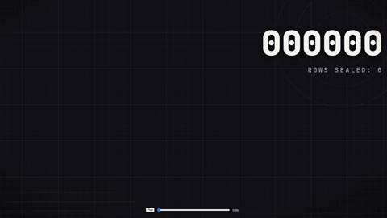
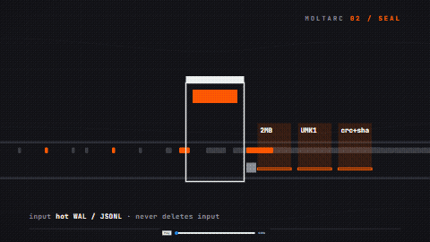
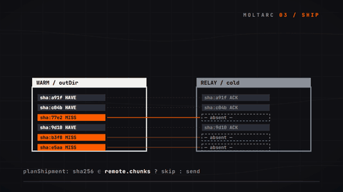
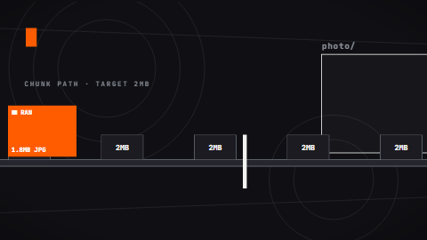
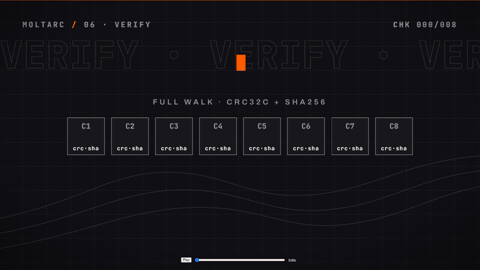
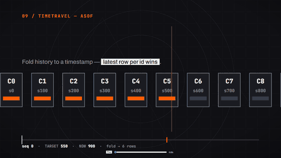
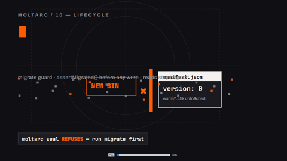

# moltarc — shrink + ship + find


Universal append-only pipeline for game events, file versions, device
telemetry, and entry-ledgers alike: the hot feed stays small and fast,
warm chunks compress schema-aware, cold archive ships once, query stays partial.
An entry-ledger feed is one domain among many, not the model.

```
[hot.db r/w SQLite] --seal--> [warm/*.chk 1-4MB immutable] --merge--> [cold/*.tar] + manifest.json
```

## See it work (12s each, loops)

| | |
|---|---|
| <br>**1. Hot stays plain** — 6000 rows land in plain SQLite, counter climbs, nothing custom. (`src/seal.ts` reads WAL) | <br>**2. Seal** — rows funnel into immutable chunks, 10.2x smaller on mixed text (34.5x on repetitive tx), crc+sha per chunk. (`moltarc seal`) |
| <br>**3. Ship** — relay compares hashes, only missing bytes fly, resume survives drops. (`moltarc ship`) | <br>**4. Find** — bloom prunes the candidates to a single-chunk fetch, which returns the trx. (`moltarc find`) |
| <br>**5. Photo gate** — bodies ≥256KB skip the chunk path into `photo/` + thumb sidecars. (gate: [docs/contracts.md](docs/contracts.md)) | <br>**6. Verify** — every chunk re-hashed, manifest chain checked, quarantine on mismatch. (`moltarc verify`) |
| <br>**7. Cold** — warm merges to `cold/*.tar`, prune/repack sweep, restore-from-cold drill. (`moltarc merge`) | <br>**8. P2P** — WebSocket delta sync with journal resume, HMAC-SHA256 PSK frames. (`moltarc p2p-sync`) |
| <br>**9. Timetravel** — read-only as-of query (seq or ts) with chunk proof. (`moltarc asof`) | <br>**10. Lifecycle** — hot→warm→cold end to end, acked-only forget, nothing lost. (`moltarc seal` → `ship` → `merge`) |

## Install

```bash
git clone https://github.com/arfoux/moltarc.git
cd moltarc
bun install
bun bin/moltarc.ts help
```

Requires `bun` on your `PATH`; setup and verify steps in [docs/install.md](docs/install.md).

## Quickstart (runnable)

```bash
bun examples/e2e.ts /tmp/moltarc-e2e   # 1200 rows: seal -> ship -> find, prints e2e ok
bun bin/moltarc.ts seal /tmp/hot.jsonl /tmp/moltarc/archive
bun bin/moltarc.ts ship /tmp/moltarc/archive /tmp/moltarc/relay
bun bin/moltarc.ts find /tmp/moltarc/archive evt-00000001
bun bin/moltarc.ts verify /tmp/moltarc/archive
```

Five minutes, step by step, in [docs/getting-started.md](docs/getting-started.md).

## Concepts

| Stage | One line | Deep dive |
|---|---|---|
| seal | Hot WAL/SQLite → immutable warm chunks (~2MB), per-device watermark, idempotent re-seal | [architecture](docs/architecture.md) · `seal` in [cli](docs/cli.md) |
| ship | Delta by hash to a relay dir, resumable, text lane first | [architecture](docs/architecture.md) · `ship` in [cli](docs/cli.md) |
| find | Manifest min/max + bloom prunes to a single warm-chunk fetch | [architecture](docs/architecture.md) · `find` in [cli](docs/cli.md) |
| verify | Full hash walk + chain check; corrupt chunks quarantine, repair refetches by hash | [architecture](docs/architecture.md) · `verify`/`repair` in [cli](docs/cli.md) |
| cold | Warm → `cold/*.tar` merge, prune/repack sweep, acked-only forget, restore-from-cold drill | [architecture](docs/architecture.md) · `merge`/`coldg`/`forget`/`gc` in [cli](docs/cli.md) |
| p2p | WebSocket delta sync with journal resume; HMAC-SHA256 PSK frames, trusted-LAN fallback | [architecture](docs/architecture.md) · `p2p-sync` in [cli](docs/cli.md) |
| timetravel | Read-only as-of query (seq or ts) with chunk proof | [architecture](docs/architecture.md) · `asof` in [cli](docs/cli.md) |
| migrate | Forward-only manifest upgrade to v1, backup first, write guard | [architecture](docs/architecture.md) · `migrate` in [cli](docs/cli.md) |

## Modules

| Area | Files |
|---|---|
| Pipeline | [src/seal.ts](src/seal.ts) · [src/chunk.ts](src/chunk.ts) · [src/manifest.ts](src/manifest.ts) · [src/dict.ts](src/dict.ts) · [src/ship.ts](src/ship.ts) · [src/find.ts](src/find.ts) · [src/verify.ts](src/verify.ts) · [src/cold.ts](src/cold.ts) · [src/gc.ts](src/gc.ts) |
| Sync/history/upgrade | [src/p2p.ts](src/p2p.ts) · [src/timetravel.ts](src/timetravel.ts) · [src/migrate.ts](src/migrate.ts) · [src/readonly.ts](src/readonly.ts) · [src/alerts.ts](src/alerts.ts) |
| Rails/media | [src/guard.ts](src/guard.ts) · [src/thumb.ts](src/thumb.ts) · [src/cas.ts](src/cas.ts) · [src/bundle.ts](src/bundle.ts) · [src/ticket.ts](src/ticket.ts) · [src/sensor.ts](src/sensor.ts) |
| Edges | [bin/moltarc.ts](bin/moltarc.ts) · [ext/moltarc.ts](ext/moltarc.ts) · [bench/](bench/mixed-corpus.ts) · [examples/](examples/e2e.ts) |

Ownership table with one-liners: [docs/modules.md](docs/modules.md).

## Contracts and limits

- Photo gate: bodies decoding past **256KB** become `photo/<sha>.bin` sidecars + hash refs, never inline chunks.
- Bomb caps: 16MB decompressed frame, 32MB / 50 000-member tar, 1MB bloom probe, 32MB / 8192px thumb input.
- Quarantine: a corrupt chunk parks exactly one chunk of history (1/150 in a 150-chunk archive — illustrative size, not a measured archive), never the archive; repair refetches by hash.
- Reserve: seal/merge/sweep-apply refuse below **50MB** free; `forget`/`gc` delete relay-acked chunks only.

Numbers with enforcing constants: [docs/contracts.md](docs/contracts.md).

## CLI reference

```
moltarc seal <hot.jsonl|hot.db> <outDir> [--table <name>]
moltarc ship <outDir> <relayDir> [--blobs]
moltarc find <outDir> <id>
moltarc verify <outDir>          moltarc repair <outDir> <relayDir>
moltarc status <outDir> [relayDir]   moltarc check <outDir> <relayDir>
moltarc gc <outDir> [relayDir] [--apply] [--deep-photo]
moltarc merge <outDir>           moltarc forget <outDir> <relayDir> <chunk> [chunk...]
moltarc coldg <outDir> [--apply] moltarc restore-from-cold <outDir> [--apply]
moltarc p2p-sync <peerUrl> <outDir> [--token <t>]
moltarc asof <outDir> <ts> [--seq <n>]
moltarc migrate <outDir> [--dry-run]
```

## Interop (any append-only feed)

The core accepts any append-only feed (`device_id,seq,ts,id,table,body`):
game events, file versions, and device telemetry seal with no manual
conversion, and an entry-ledger (`ledger.log` with `entry`/`undo` + `value`)
is one supported domain among many. Key table in [docs/interop.md](docs/interop.md)
(proof: `test/interop.test.ts`).


## Honest SLA (measured, not planned)

- Repetitive tx text, 60% tx slice of `bun bench/mixed-corpus.ts` (6000 rows, seed 7) → **34.5x**
- Mixed text+notes+refs, full mixed corpus of `bun bench/mixed-corpus.ts` (6000 rows, seed 7, blob bytes excluded) → **10.2x**
- Real jpeg bytes, raw zstd over the 50 real jpeg of `bun bench/photo-bench.ts` (128x128 blurred noise, q85, 600 text rows, seed 11) → **1.05x** (details in [Photo SLA](#photo-sla))
- Trained 32KB dict on repetitive text, `bun bench/dict-bench.ts` (12000 rows, seed 7, same corpus both sides) → **1.8%** smaller warm (2003B measured, seed 7; details in [Dict SLA](#dict-sla))

Details in [Measured SLA](#measured-sla) below. Older micro-benchmark (5-template repetitive log, 3.45MB → 10.7KB = 323x)
is retired: too repetitive to plan from.

## Where it sits (dimensions, not scores)

| | moltarc | Litestream | restic/kopia | Turso/D1 |
|---|---|---|---|---|
| query 1 row without full restore | ✅ | ❌ | ❌ | ✅ |
| cheap tiered cold archive | ✅ | ❌ | ~ | ❌ |
| hash-delta ship + resume on bad links | ✅ | ~ | ✅ | ❌ |
| runs offline on potato hardware | ✅ | ✅ | ~ | ❌ |
| blob split (photos skip the text path) | ✅ | ❌ | ~ | ❌ |
| as-of query over history | ✅ | ❌ | ❌ | ~ |
| corrupt chunk quarantines 1/150, not total-loss | ✅ | ~ | ✅ | ~ |
| schema-aware dict per table | ✅ | ❌ | ❌ | ❌ |

Full 13-system × 10-dimension matrix with footnotes: [docs/comparison.md](docs/comparison.md).

## Measured SLA

<!-- SLA-MEASURED-START -->
| corpus | input | warm archive | ratio |
|---|---|---|---|
| repetitive tx text (60% repetitive tx) | 1.64MB | 48.6KB | **34.5x** |
| mixed text+notes+refs (blob bytes excluded) | 2.40MB | 241.0KB | **10.2x** |
| photo blobs (3.23MB sidecar, lazy/on-demand) | excluded | excluded | n/a (incompressible) |

_Measured by `bun bench/mixed-corpus.ts --write-readme`; corpus deterministic (seeded). Blob bytes never enter the mandatory archive — only `blob:sha256:…` refs do._
<!-- SLA-MEASURED-END -->

## Photo SLA

<!-- PHOTO-MEASURED-START -->
| bytes | input | warm archive | ratio |
|---|---|---|---|
| 50 real jpeg (128x128 blurred noise, q85, 577KB raw) sealed as base64 lines | base64 in jsonl | per-table chunks | **1.41x** |
| same jpeg bytes, raw zstd (the photo claim) | 577KB raw | zstd | **1.05x, inside 1.0-1.2x** |
| tx text beside the photos | text jsonl | text chunks + dict | **26.8x** |
| 1 gate-sized jpeg (640x640 blurred noise, q85, 273KB raw, over the 256KB photo gate) | base64 line | photo/*.bin sidecar + hash ref | quarantined (bytes excluded) |

_Measured by `bun bench/photo-bench.ts --write-readme`; deterministic (seeded). The 128x128 variants (~12KB each) sit below the 256KB photo gate and seal inline — only the gate-sized row exercises the quarantine path. The base64 line ratio rides above raw because of the text envelope — raw jpeg bytes sit at ~1.05x, which is why photo bytes never enter the mandatory archive (hash refs only, lazy fetch)._
<!-- PHOTO-MEASURED-END -->

## Dict SLA

<!-- DICT-MEASURED-START -->
| repetitive text, dict off vs on | warm (16KB chunks) | ratio | warm (2MB production chunks) | ratio |
|---|---|---|---|---|
| plain (no trained dict) | 109.5KB | **30.3x** | 86.7KB | **38.3x** |
| with 32KB per-table dict | 107.6KB | **30.8x** | 86.9KB | **38.2x** |
| saving | 2.0KB (1.8%) | — | -0.2KB (-0.2%) | — |

_Measured by `bun bench/dict-bench.ts --write-readme`; same corpus both sides, only the dictionary differs. Columnar delta/RLE/inline-dict already captures most repetition — the trained dict takes what is left. Small variant sealed with targetBytes=16384 (7 chunks); production variant with targetBytes=2097152 (1 chunks), where one chunk amortizes the cold start._
<!-- DICT-MEASURED-END -->

## Docs index

- [docs/install.md](docs/install.md) — prerequisites, setup, verify-the-install
- [docs/getting-started.md](docs/getting-started.md) — 5-minute runnable quickstart
- [docs/architecture.md](docs/architecture.md) — hot/warm/cold + sync/history/upgrade
- [docs/cli.md](docs/cli.md) — every subcommand, flags verified against `bin/moltarc.ts`
- [docs/modules.md](docs/modules.md) — module ownership table
- [docs/contracts.md](docs/contracts.md) — numeric contracts and gates
- [docs/interop.md](docs/interop.md) — fielog `ledger.log` interop + field aliases
- [docs/troubleshooting.md](docs/troubleshooting.md) — symptoms, exact errors, fixes
- [docs/bench.md](docs/bench.md) — how SLA numbers are measured + flake policy
- [docs/compat.md](docs/compat.md) — N-2 codec rule, manifest tolerance, native binary note
- [docs/decisions.md](docs/decisions.md) — why each load-bearing choice
- [docs/comparison.md](docs/comparison.md) — 13-system comparison matrix
- [CHANGELOG.md](CHANGELOG.md) — user-visible changes per tag, from `git log`

## Contributing, conduct, security

- [CONTRIBUTING.md](CONTRIBUTING.md) — setup, scoped tests, bench/regen rule, PR flow (CI: typecheck + `test:stable` + `ext/`; heavy nightly)
- [CODE_OF_CONDUCT.md](CODE_OF_CONDUCT.md) — Contributor Covenant, short version
- [SECURITY.md](SECURITY.md) — what is in scope, private advisory reporting, best-effort response

## License

MIT — see [LICENSE](LICENSE).
